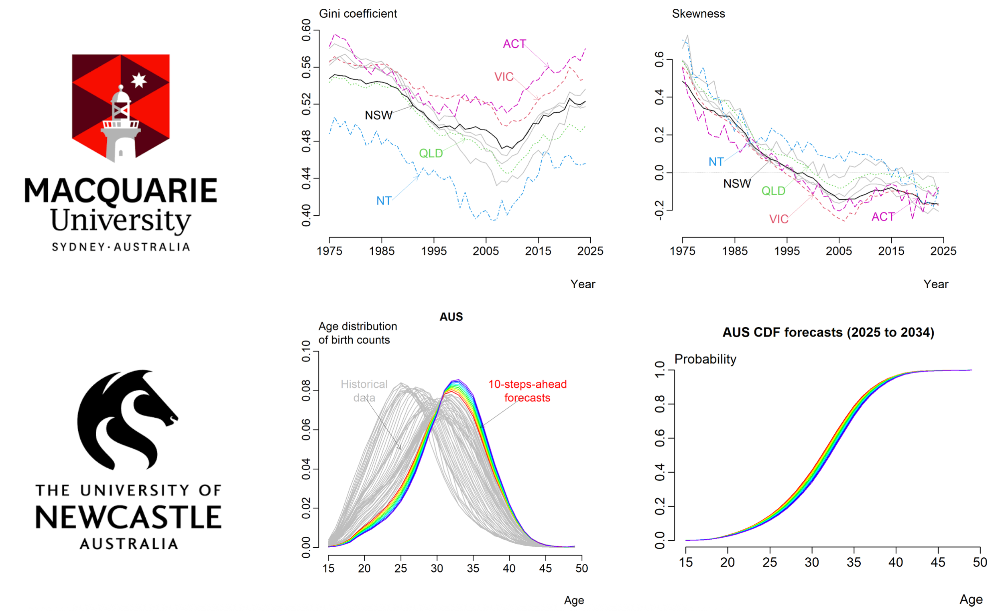

<!-- PROJECT LOGO -->
 

  

<h3 align="center">Visualizing, modeling and forecasting age distribution of fertility</h3>

<!-- ABOUT THE PROJECT -->
## Abstract

The study of fertility differences has often focused on average fertility levels, such as age-specific fertility rates, while neglecting the age distribution of fertility. We introduce three novel summary statistics to analyze fertility distributions: we identify the modal age of women for each year; we use Wasserstein distance to find the medoid density; and we apply Taylor’s power law to assess regional heterogeneity in the age distribution of fertility. Then, we present two methods for modeling and forecasting state-wise fertility gaps. A compositional data analytic framework, particularly centered log-ratio transformation, is employed to generate out-of-sample density forecasts. The cumulative distribution function supports the visualization and comparison of fertility densities. Applied to Australian birth counts from 1975 to \commHS{2024}, our results show a decline in births alongside continued postponement of childbearing, with Victoria projected to experience greater delays than New South Wales and Queensland.
 

Han Lin Shang - hanlin.shang@mq.edu.au

Yang Yang - yang.yang10@newcastle.edu.au

 
    <a href="https://github.com/YangANU/Ensemble_Mortality_Models"><strong>Explore R code »</strong></a>
 
